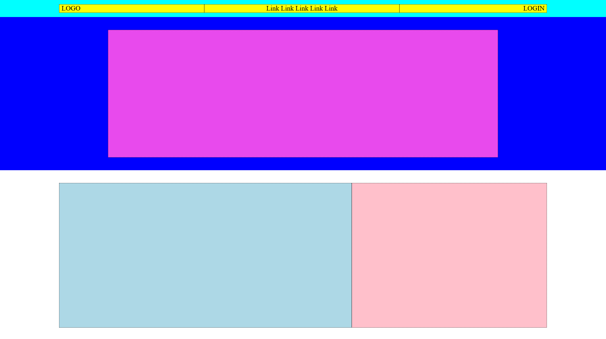
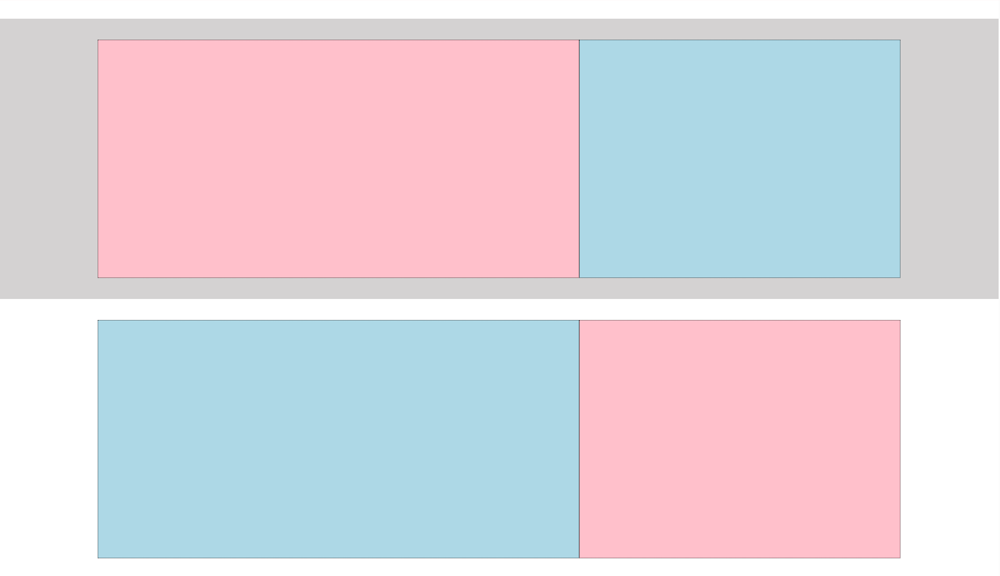
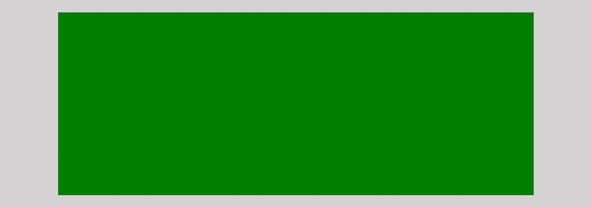
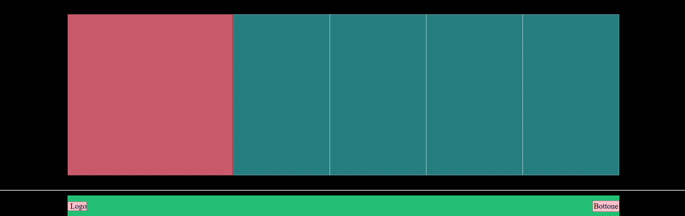

  

<h1 align="center">Struttura Discord</h1>

Pagina HTML/CSS che riproduce la struttura di base del sito Discord
utilizzando blocchi colorati al posto dei contenuti reali, con focus sul layout
e sulla suddivisione delle sezioni principali.

## Obiettivo

- Riprodurre la struttura principale del layout ispirato a Discord
  usando blocchi colorati al posto di testi e immagini reali
- Individuare il layout generale della pagina e procedere dall’alto verso il basso
  (header, sezioni centrali, footer)
- Lavorare una sezione alla volta, assicurandosi che quella precedente sia impostata correttamente
  prima di passare alla successiva

## Anteprima

  
  
  

## Tecnologie utilizzate

- HTML5  
- CSS3
